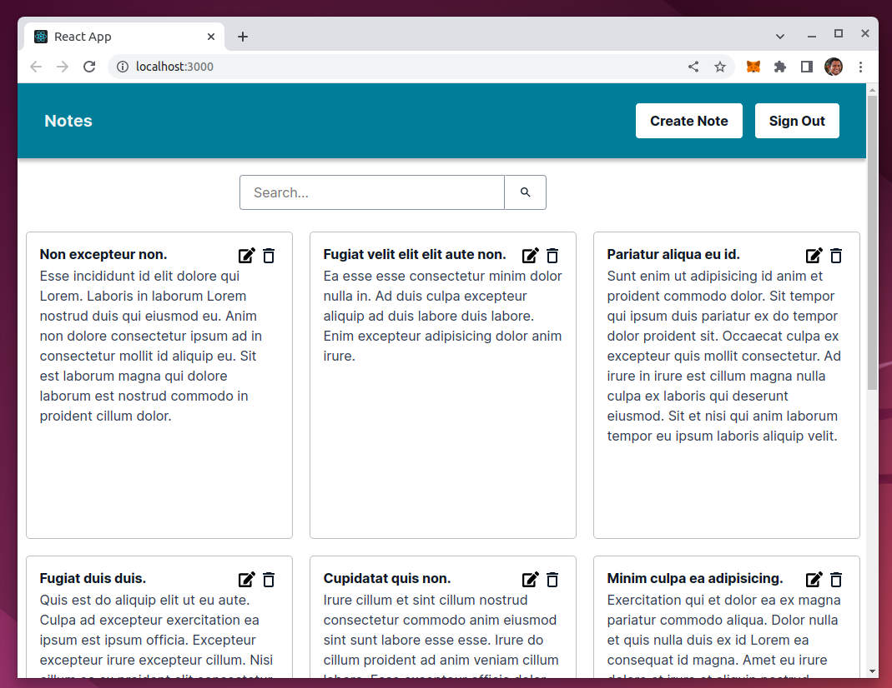
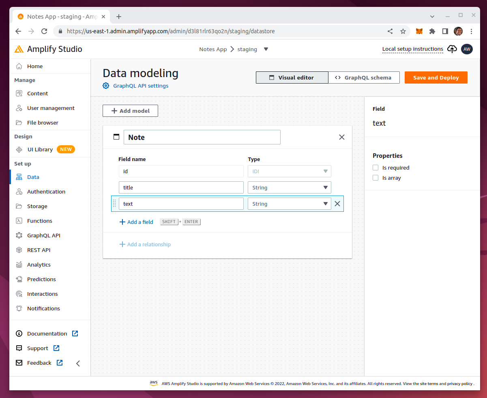
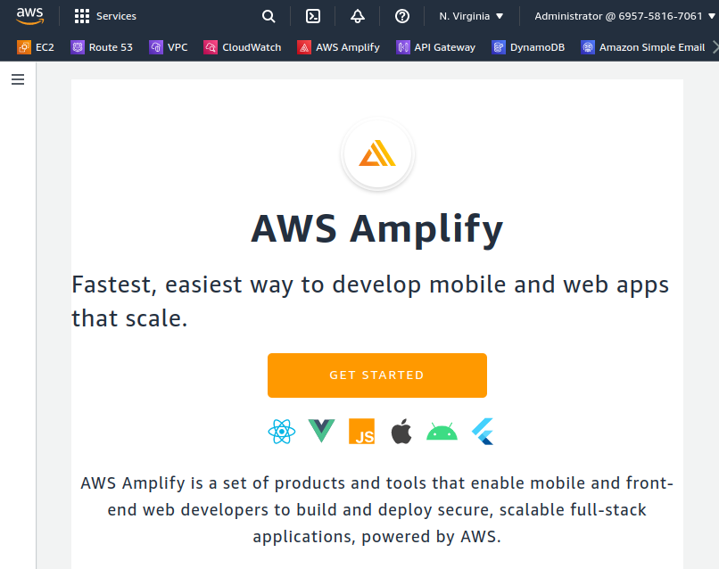
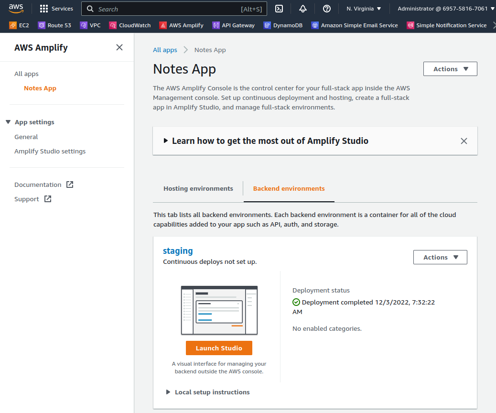
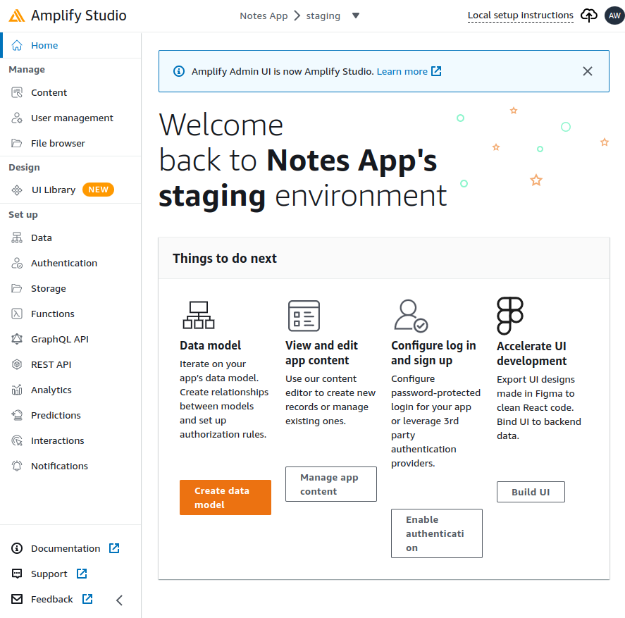
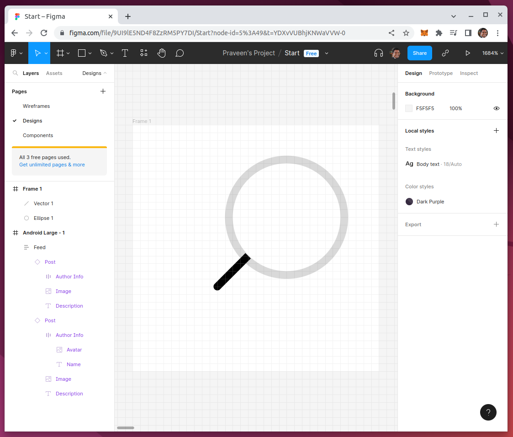
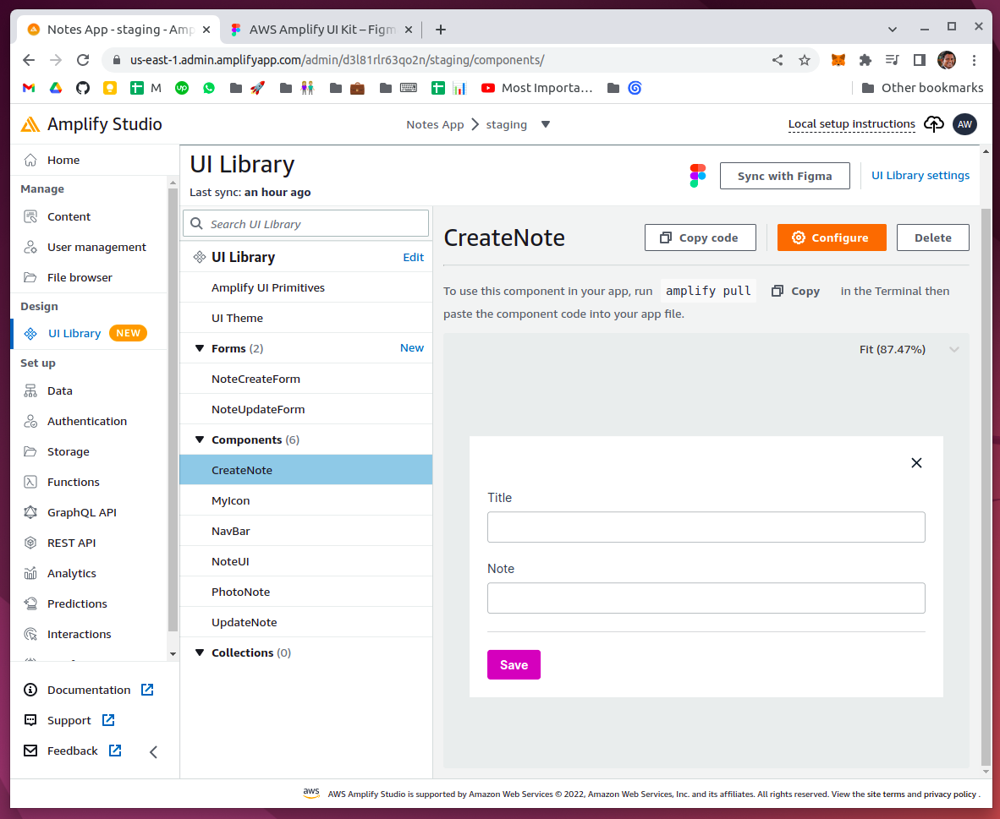
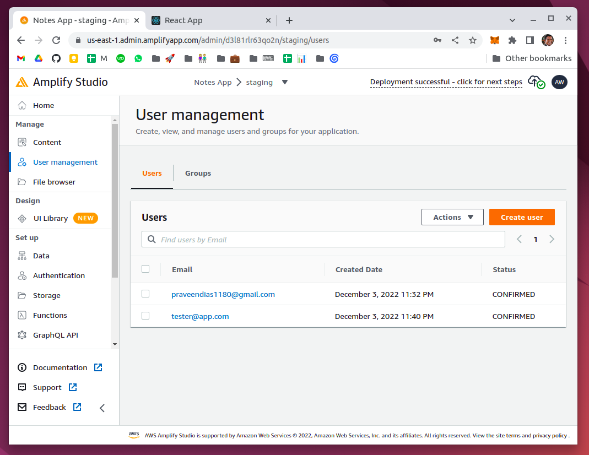

# Notes App



# IndexedDB | DynomoDB | Amplify DataStore

When you create a data model with AWS Amplify Studio, you are using DataStore. DataStore persists your data both online and offline without any extra work on your end. In the browser, it stores data in IndexedDB which is similar to localStorage. It will also save your data to the cloud using an Amazon DynamoDB database.



# Setup

## Amplify Studio



## Notes App






# Designing Icons in Figma



# AWS Amplify UI Kit



# Install Amplify CLI

```
npm install -g @aws-amplify/cli
```

# Notes App Ready


# Authentication and Authorization

